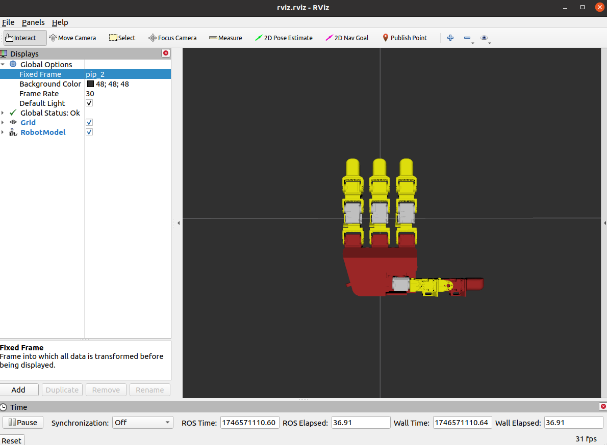
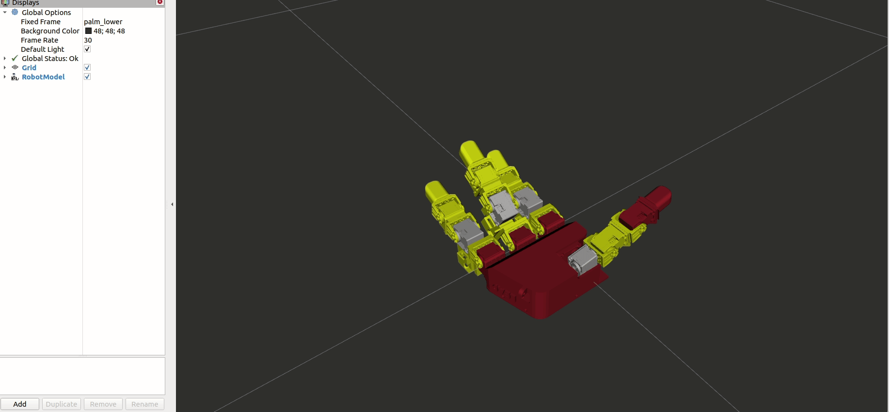

# LEAP Hand Controller (Custom Fork)

> **Looking for the original?** This repository is a custom fork. Please visit the upstream projects:
> - **[IRVLUTD/leap_inhand](https://github.com/IRVLUTD/leap_inhand)** -- The IRVL Lab's ROS packages for LEAP Hand in-hand manipulation, which this fork is directly built upon.
> - **[leap-hand/LEAP_Hand_API](https://github.com/leap-hand/LEAP_Hand_API)** -- The original LEAP Hand API by Shaw et al.

We mainly follow the [IRVLUTD/leap_inhand](https://github.com/IRVLUTD/leap_inhand) design, with the following modifications:

- **Unified control loop** -- Read and write operations are combined into a single control thread running at 80 Hz (configurable), instead of separate read/write paths. This reduces latency and avoids timing conflicts on the USB bus.
- **Command clamping** -- Commanded joint positions are delta-clamped relative to the current joint state (`max_delta_q` parameter, default 0.15 rad/step), resulting in safer and smoother motions.
- **Left and right hand support** -- Fixed the left vs. right hand issue so that the controller works correctly on both hands, with proper joint limits and port mapping for each.
- **Docker environment** -- Added a Docker setup so you can run this ROS Noetic controller on Ubuntu 22.04 (or newer) without installing ROS natively. The entrypoint also automatically reduces USB latency for Dynamixel communication.
- **Port configuration guide** -- Includes udev rules documentation for binding specific LEAP Hand hardware to persistent device symlinks (`/dev/ttyLEAP_RIGHT`, `/dev/ttyLEAP_LEFT`).

If you use LEAP Hand in an academic setting, please cite the original paper:

```bibtex
@article{shaw2023leaphand,
  title={LEAP Hand: Low-Cost, Efficient, and Anthropomorphic Hand for Robot Learning},
  author={Shaw, Kenneth and Agarwal, Ananye and Pathak, Deepak},
  journal={Robotics: Science and Systems (RSS)},
  year={2023}
}
```

---

## Repository Structure

```
leap_inhand/
├── Dockerfile                  # ROS Noetic Docker image
├── docker-compose.yml          # One-command launch with device passthrough
├── docker/
│   └── entrypoint.sh           # Sources ROS, reduces USB latency
├── leap_description/           # URDF models and visualization
│   ├── robots/
│   │   ├── leap_right.urdf
│   │   └── leap_left.urdf
│   ├── meshes/                 # STL mesh files
│   └── launch/
│       └── visualize_robot.launch
├── leap_hand/                  # Controller package
│   ├── scripts/
│   │   ├── leaphand_node.py    # Main controller node
│   │   ├── leap_hand_state_publisher.py
│   │   ├── random_pos.py       # Test script for random positions
│   │   └── leap_hand_utils/
│   │       ├── dynamixel_client.py
│   │       └── leap_hand_utils.py
│   ├── launch/
│   │   └── leap.launch         # Main launch file
│   └── srv/                    # ROS service definitions
└── images/                     # Documentation images
```

---

## Quick Start (Docker)

Docker is the recommended way to run this controller. It works on Ubuntu 20.04, 22.04, 24.04, or any system with Docker installed -- no native ROS Noetic installation required.

### Prerequisites

- [Docker](https://docs.docker.com/engine/install/) and [Docker Compose](https://docs.docker.com/compose/install/) installed
- LEAP Hand connected via USB

### 1. Build the Docker Image

```bash
docker compose build
```

### 2. Configure USB Ports

Plug in the LEAP Hand USB cable and identify the device:

```bash
ls /dev/serial/by-id/
```

You should see something like `usb-FTDI_USB__-__Serial_Converter_FT7W91VW-if00-port0`.

The controller expects devices at `/dev/ttyLEAP_RIGHT` and `/dev/ttyLEAP_LEFT`. Create udev rules so these symlinks persist across reboots:

```bash
# Step 1: Find the serial number for each hand.
# Plug in one hand at a time and run:
udevadm info -a /dev/serial/by-id/<your-device-id> | grep '{serial}'

# Step 2: Create udev rules (substitute your actual serial numbers):
echo 'SUBSYSTEM=="tty", ATTRS{idVendor}=="0403", ATTRS{idProduct}=="6014", ATTRS{serial}=="FT7W91VW", SYMLINK+="ttyLEAP_RIGHT"' \
  | sudo tee /etc/udev/rules.d/99-leap-hand.rules

echo 'SUBSYSTEM=="tty", ATTRS{idVendor}=="0403", ATTRS{idProduct}=="6014", ATTRS{serial}=="FT950ZLA", SYMLINK+="ttyLEAP_LEFT"' \
  | sudo tee -a /etc/udev/rules.d/99-leap-hand.rules

# Step 3: Reload rules
sudo udevadm control --reload-rules && sudo udevadm trigger
```

> **Tip:** You can verify the symlinks were created with `ls -la /dev/ttyLEAP_*`.

Alternatively, you can edit the port mapping directly in `leap_hand/scripts/leaphand_node.py` (the `ports` dictionary) to point to your `/dev/serial/by-id/...` paths.

### 3. Launch the Controller

```bash
# Default launch (uses settings from docker-compose.yml)
docker compose up

# Or launch with specific hand and parameters
docker compose run --rm leap_hand roslaunch leap_hand leap.launch \
  hand:=right kP:=800.0 kI:=0.0 kD:=200.0 curr_lim:=550.0
```

### 4. Interact with the Running Controller

```bash
# Open a shell inside the running container
docker exec -it leap_hand_controller bash

# Inside the container, ROS is already sourced:
rostopic echo /leap_hand_state
rosservice call /leap_pos_vel
```

Or start a fresh container with a shell:

```bash
docker compose run --rm leap_hand bash
```

---

## Native Setup (Without Docker)

If you prefer to run without Docker, you need ROS Noetic installed (Ubuntu 20.04).

### Dependencies

```bash
pip3 install numpy dynamixel-sdk
sudo apt install ros-noetic-robot-state-publisher ros-noetic-joint-state-publisher
```

### Build

```bash
cd ~/catkin_ws
catkin_make
source devel/setup.bash
```

### Launch

```bash
# Right hand
roslaunch leap_hand leap.launch hand:=right

# Left hand
roslaunch leap_hand leap.launch hand:=left
```

---

## Controller Details

### Architecture

The main controller ([leaphand_node.py](leap_hand/scripts/leaphand_node.py)) runs a single control loop in a dedicated thread:

1. **Read** -- Reads current joint positions and velocities from the Dynamixel motors
2. **Clamp** -- Delta-clamps the commanded position relative to the current state (prevents sudden jumps)
3. **Write** -- Sends the clamped target positions to hardware

This unified read-write loop runs at 80 Hz by default and eliminates the timing conflicts that can occur when reads and writes happen on separate threads competing for the USB bus.

### Simulation-Aligned Conventions

The controller uses LEAP Hand simulation conventions where all joints set to 0 means the hand is fully open. This matches common simulation environments like Isaac Sim. Internally, a pi-offset is applied when communicating with the Dynamixel motors.

### ROS Topics

| Topic | Type | Description |
|---|---|---|
| `/leaphand_node/cmd_leap` | `sensor_msgs/JointState` | Subscribe to command joint positions (16 joints) |
| `/leap_hand_state` | `sensor_msgs/JointState` | Published joint state (positions, velocities) |

### ROS Services

| Service | Type | Description |
|---|---|---|
| `/leap_position` | `leap_position` | Returns current joint positions |
| `/leap_velocity` | `leap_velocity` | Returns current joint velocities |
| `/leap_pos_vel` | `leap_pos_vel` | Returns positions and velocities (recommended, saves latency) |

### Launch Parameters

| Parameter | Default | Description |
|---|---|---|
| `hand` | `right` | Hand type: `left` or `right` |
| `kP` | `800.0` | Proportional gain (reduce for less jitter, increase for strength) |
| `kI` | `0.0` | Integral gain |
| `kD` | `200.0` | Derivative gain (reduce for less jitter, increase for strength) |
| `curr_lim` | `550.0` | Current limit in mA (max 600 for full, 350 for lite) |
| `show_rviz` | `false` | Launch RViz for visualization |

> **Note:** The side-to-side MCP joints (0, 4, 8) automatically receive 75% of the kP and kD values for more compliant lateral motion.

### Joint Mapping

The hand has 16 joints numbered 0-15:

| Finger | MCP Side | MCP Forward | PIP | DIP |
|---|---|---|---|---|
| Index | 0 | 1 | 2 | 3 |
| Middle | 4 | 5 | 6 | 7 |
| Ring | 8 | 9 | 10 | 11 |
| Thumb | 12 | 13 | 14 | 15 |

---

## LEAP Description Package

The `leap_description` package provides URDF models for both hands, including STL meshes and joint limit definitions.

### Visualize in RViz

```bash
# Right hand
roslaunch leap_description visualize_robot.launch urdf_file:=leap_right.urdf

# Left hand
roslaunch leap_description visualize_robot.launch urdf_file:=leap_left.urdf
```

To use RViz from within Docker, forward the X11 display:

```bash
xhost +local:docker
docker compose run --rm \
    -e DISPLAY=$DISPLAY \
    -v /tmp/.X11-unix:/tmp/.X11-unix \
    leap_hand roslaunch leap_hand leap.launch show_rviz:=true
```

<p align="center">
    
</p>

---

## Hardware Tips

- **Power**: Connect 5V power to the hand. The Dynamixels should light up briefly during boot.
- **USB**: Connect via Micro USB. Avoid long USB extension chains.
- **USB Latency**: The Docker entrypoint automatically sets USB latency to 1ms. For native setups, see the [Dynamixel USB latency guide](https://emanual.robotis.com/docs/en/software/dynamixel/dynamixel_wizard2/) and set Return Delay Time (register 9) to 0 via Dynamixel Wizard.
- **Port Detection**: Use [Dynamixel Wizard](https://emanual.robotis.com/docs/en/software/rplus1/dynamixel_wizard/) to identify ports. Note: the wizard and this controller cannot use the same port simultaneously.

## Troubleshooting

| Problem | Solution |
|---|---|
| Motor is 90/180/270 degrees off | The horn is mounted incorrectly on the motor. Remount it. |
| No motors detected | Check serial port permissions (`sudo chmod 666 /dev/ttyUSB*` or add user to `dialout` group) |
| Some motors missing | Verify motor IDs and U2D2 connections |
| "Overload error" / motors flashing red | Motors have overloaded (e.g., self-collision). Power cycle to clear. Lower `curr_lim` if frequent. |
| Jittery motors | Lower `kP` and `kD` values |
| Motors feel weak or inaccurate | Raise `kP` and `kD` values |
| Hand jumps on startup | The `max_delta_q` clamping should prevent this. If it still occurs, reduce `max_delta_q`. |

---

## Acknowledgements

This work would not be possible without the following projects and their authors:

- **[IRVLUTD/leap_inhand](https://github.com/IRVLUTD/leap_inhand)** -- We are grateful to the [Intelligent Robotics and Vision Lab (IRVL)](https://labs.utdallas.edu/irvl/) at UT Dallas for their ROS Noetic packages for LEAP Hand control and in-hand manipulation. Their codebase provided the foundation for this fork, including the simulation-aligned joint conventions, service-based state querying, and URDF models. We highly recommend checking out [their repository](https://github.com/IRVLUTD/leap_inhand) for the original implementation and their research on in-hand manipulation.

- **[leap-hand/LEAP_Hand_API](https://github.com/leap-hand/LEAP_Hand_API)** -- We thank Shaw, Agarwal, and Pathak for creating the LEAP Hand and releasing the original API. The LEAP Hand is an incredible low-cost, dexterous robotic hand platform that has enabled a wide range of robot learning research.

---

## License

This code is released under the MIT License. See [LICENSE](LICENSE) for details.

The CAD files from the original LEAP Hand project are provided under a CC BY-NC-SA (Attribution-NonCommercial-ShareAlike) license.

<p align="center">
    
</p>
